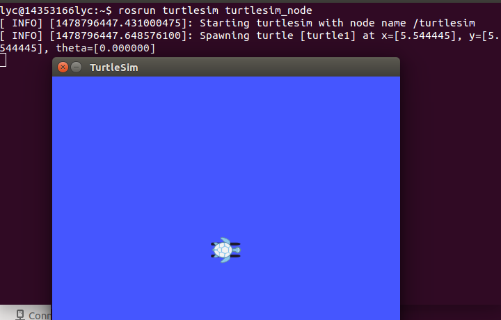
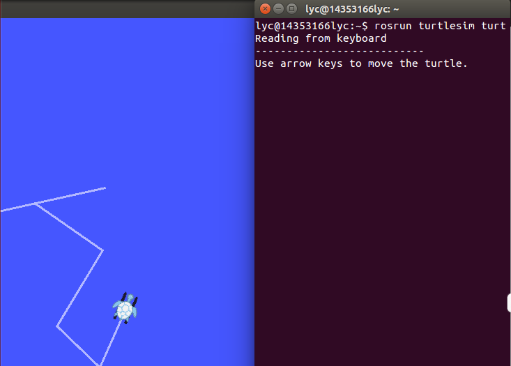
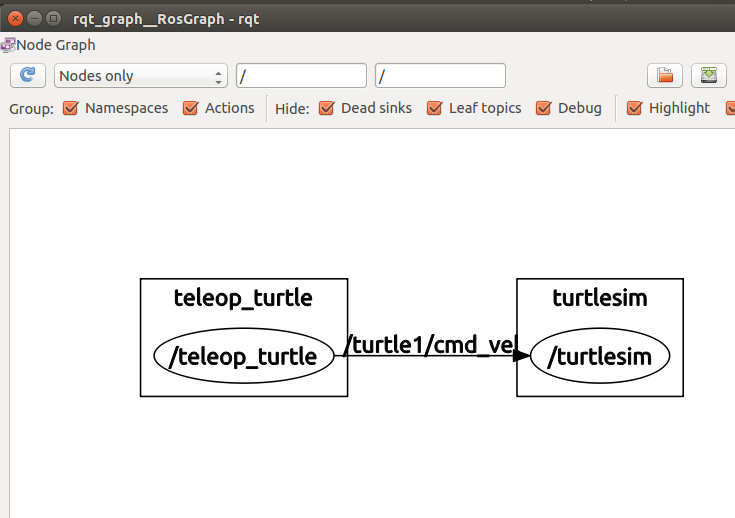
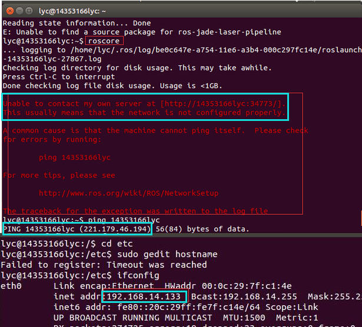

# 安装ROS
## 实验环境 
  Ubantu14.04 32位系统
## 实验步骤
  * 设置source.list（转镜像服务器）
    ` sudo sh -c '. /etc/lsb-release && echo "deb http://mirror.sysu.edu.cn/ros/ubuntu/ $DISTRIB_CODENAME main" > /etc/apt/sources.list.d/ros-latest.list' `
  
  * 设置钥匙
    ` sudo apt-key adv --keyserver hkp://ha.pool.sks-keyservers.net:80 --recv-key 0xB01FA116 `
 
  * 安装
   - 确保虚拟机的Debian软件包索引是最新的：
    ` sudo apt-get update `
   - 桌面完整版安装： 包含ROS、rqt、rviz、通用机器人函数库、2D/3D仿真器、导航以及2D/3D感知功能
    ` sudo apt-get install ros-jade-desktop-full `
 
  * 初始化rosdep:
    
    ```
    sudo rosdep init
    rosdep update
    ```
  * 环境配置：如果每次打开一个新的终端时ROS环境变量都能够自动配置好（即添加到bash会话中），那将会方便很多
   
   ```
   echo "source /opt/ros/jade/setup.bash" >> ~/.bashrc
source ~/.bashrc
   ```
   如果想改变当前终端下的环境变量，可以执行以下命令:
   ` source /opt/ros/jade/setup.bash `

  * 安装rosinatall
    ` sudo apt-get install python-rosinstall `
   
   rosinstall 是ROS中一个独立分开的常用命令行工具，它可以方便让你通过一条命令就可以给某个ROS软件包下载很多源码树。 
 

  至此，整个安装过程结束。

## 测试
  安装ROS成功后,在Beginner Tutorials中有一个简单的示例程序
  1. 在Terminal中输入一下命令.该命令是初始化ROS环境,全局参数,以及每个节点注册等工作.
   
  ` $ roscore `
  
  如下图：
  
  
  2. 再打开一个Terminal,输入下诉命令.开启一个小乌龟界面.

    ` $ rosrun turtlesim turtlesim_node `
   
   如下图：
  
   
  3. 再打开一个Terminal,输入下述命令。接受键盘输入,控制小乌龟移动.

    ` $ rosrun turtlesim turtle_teleop_key `
   
   选中该Terminal,键盘按下上下左右按键,可看到控制小乌龟移动，如下图：
   

  4. 再打开一个Terminal,输入以下命令,可以看到当前ROS nodes以及Topic等图形展示.

    ` $ rosrun rqt_graph rqt_graph `
 
   
   
   由上图可看见，左右两边矩形为ROS node，中间连线上是Topic名称。
   
   至此，ROS配置结束，由测试结果可知ROS安装成功。
   

## 实验过程中遇到的问题：

  1. 测试的时候打roscore语句，出现如下错误：
  
  提示说连不上我的服务器，后来ping了一下我的主机，ip地址是221.179.46.194，与我用ifconfig语句查看的ip地址192.168.13.144不符，后然在Computer/etc下修改hosts,添加ip地址和主机名条目：192.168.14.133 14353166lyc就可以了。

  2. 一开始不知道终端前面 /s 和 ~s 的区别，后来用 ls 命令输出当前文件夹，发现 /s 是根目录（Computer），~s是终端默认打开的目录（Home目录，也即Computer/home/lyc/Home）
  cd .. 返回上层目录
  cd / 返回根目录（Computer, /s）
  cd . 当前目录
  如下图，输出了目录的子文件以及cd .. 等指令的操作：
  

## 实验感想：
   本次试验主要按照教程复制粘贴指令，但是也要看清楚英文文档中那些指令要敲，哪些不用敲，这有点考验我的英文水平，不过还好，都能顺利读懂并成功做下来。实验过程中遇到如上一些错误，在解决错误的过程中我也学到了很多。